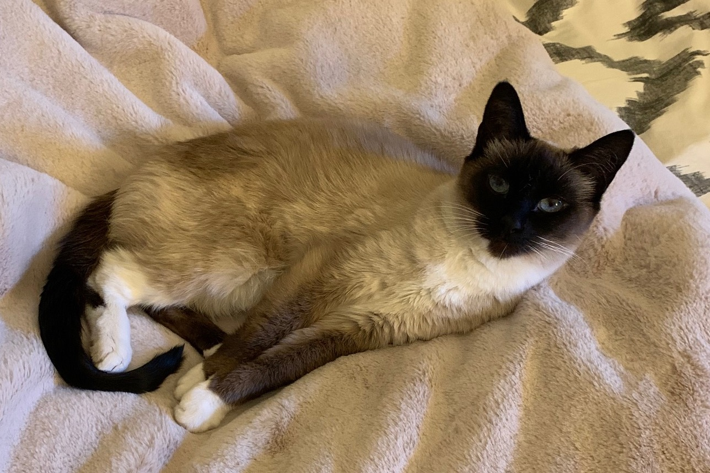
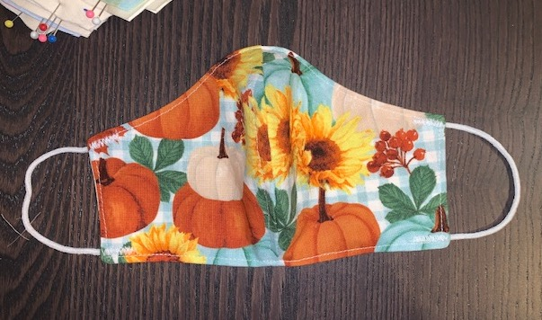
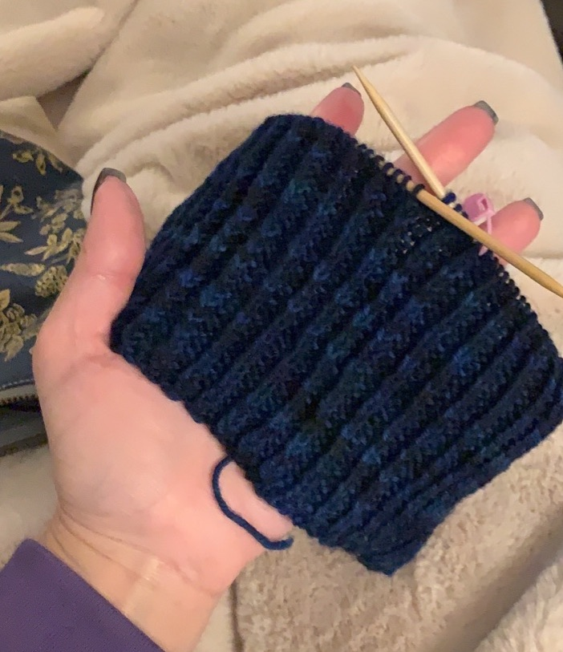

## Notes/References/Links

 To make a 1st header type: # Header 1
 
 To make a 2nd header type: ## Header 2
 
 To make a 3rd header type: ### Header 3
 
 You can continue on with smaller and smaller headers which correspond to the number of hashtags that begin the line. 

 In order to make a bulleted list: 
 
 Type in: space,dash,space followed by the bulleted text
 
 To indent in again, type in: space space,dash,space followed by the next bulleted text

 To make a numbered list:
 
 Type in: space,1.,space (this will be a Roman numeral list

 For fonts:
  - Type: double asterisk "the word" double asterisk Looks like -> **Bold**
  - Type: underscore "the word" underscore Looks like -> _Italic_ 
  
  How to link a page: [Hyperlinked Text](the link to the page)
  
  How to insert a picture: 
  
  Many more tricks to learn here: [Mastering Markdown](https://guides.github.com/features/mastering-markdown/)

### About me!

Hello! My name is Shelby. I am a Washington native currently living in Seattle proper. I grew up about 30 minutes north of the city in Mukilteo and I attended college in Ellensburg at Central Washington University. I am currently a little over 5.5 years in at Amazon as an Executive assistant and worked in the same role at Microsoft on various teams for another about 5.5 years. Some fun facts about me are that I grew up in dance classes, I love cats and have an 11 year old Siamese, am recently into buying and caring for house plants and finally, have brushed up on a few of my many crafting skills (cross stitch, knitting, sewing) during quarantine.

### My very first webpage :)

Check me out! [Paw Pals Adoption](https://pawpalsadopt.shelbyharner.repl.co/)
